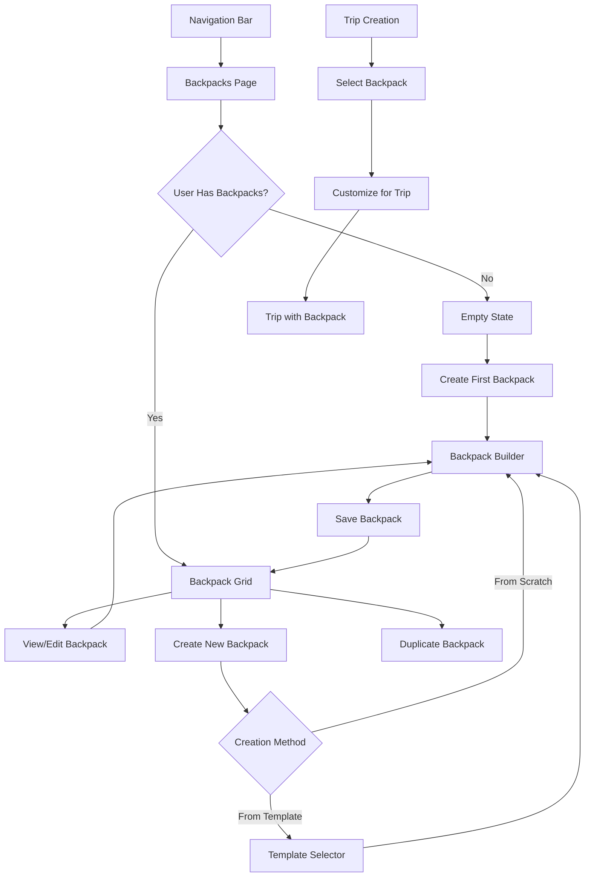

# Backpack Management UX Design Guide

## Overview

The Backpack Management system is a core feature of BeyondTrailTales that allows users to create, organize, and reuse backpack configurations across different trips. This guide provides comprehensive UX flows, visual designs, and implementation guidelines for the entire backpack management ecosystem.

## 1. Overall UX Flow

### 1.1 Primary User Journeys



### 1.2 Key User Stories

1. **First-time User**: Discovers backpack management, creates first configuration using templates
2. **Experienced Hiker**: Manages multiple backpack setups for different trip types
3. **Trip Planner**: Selects appropriate backpack when creating a new trip
4. **Gear Optimizer**: Reviews and optimizes backpack weight distribution

## 2. Visual Design System

### 2.1 Backpack Type Icons and Colors

```javascript
// Icon and color mapping for backpack types
const BACKPACK_VISUALS = {
  daypack: {
    icon: 'backpack-small',
    primaryColor: '#3b82f6',    // Blue
    secondaryColor: '#60a5fa',
    gradient: 'linear-gradient(135deg, #3b82f6 0%, #60a5fa 100%)',
    iconPath: 'M12 2L4 7v10c0 1.1.9 2 2 2h12c1.1 0 2-.9 2-2V7l-8-5z',
    capacity: '20-35L'
  },
  weekend: {
    icon: 'backpack-medium',
    primaryColor: '#10b981',    // Green
    secondaryColor: '#34d399',
    gradient: 'linear-gradient(135deg, #10b981 0%, #34d399 100%)',
    iconPath: 'M12 2L3 7v12c0 1.1.9 2 2 2h14c1.1 0 2-.9 2-2V7l-9-5z',
    capacity: '35-55L'
  },
  'thru-hike': {
    icon: 'backpack-large',
    primaryColor: '#f59e0b',    // Orange
    secondaryColor: '#fbbf24',
    gradient: 'linear-gradient(135deg, #f59e0b 0%, #fbbf24 100%)',
    iconPath: 'M12 2L2 8v12c0 1.1.9 2 2 2h16c1.1 0 2-.9 2-2V8l-10-6z',
    capacity: '55-75L'
  },
  ultralight: {
    icon: 'backpack-ultralight',
    primaryColor: '#8b5cf6',    // Purple
    secondaryColor: '#a78bfa',
    gradient: 'linear-gradient(135deg, #8b5cf6 0%, #a78bfa 100%)',
    iconPath: 'M12 2L5 6v10c0 1.1.9 2 2 2h10c1.1 0 2-.9 2-2V6l-7-4z',
    capacity: '40-60L'
  },
  expedition: {
    icon: 'backpack-expedition',
    primaryColor: '#ef4444',    // Red
    secondaryColor: '#f87171',
    gradient: 'linear-gradient(135deg, #ef4444 0%, #f87171 100%)',
    iconPath: 'M12 2L1 9v13c0 1.1.9 2 2 2h18c1.1 0 2-.9 2-2V9l-11-7z',
    capacity: '70-100L'
  }
}
```

### 2.2 Backpack Card Design

```css
/* Backpack Card Visual Structure */
.backpack-card {
  /* Glass morphism effect */
  background: rgba(255, 255, 255, 0.05);
  backdrop-filter: blur(10px);
  border: 1px solid rgba(255, 255, 255, 0.1);
  border-radius: 16px;
  padding: 24px;
  transition: all 0.3s cubic-bezier(0.4, 0, 0.2, 1);
  
  /* Hover state */
  &:hover {
    transform: translateY(-4px);
    box-shadow: 0 8px 32px rgba(0, 0, 0, 0.2);
    border-color: var(--primary-color, #3b82f6);
  }
}

/* Type indicator badge */
.backpack-type-badge {
  display: inline-flex;
  align-items: center;
  gap: 8px;
  padding: 6px 12px;
  background: var(--type-gradient);
  border-radius: 20px;
  font-size: 14px;
  font-weight: 500;
  color: white;
}

/* Visual capacity indicator */
.capacity-visual {
  width: 100%;
  height: 120px;
  position: relative;
  margin: 16px 0;
  
  /* Backpack silhouette */
  .backpack-silhouette {
    position: absolute;
    width: 100%;
    height: 100%;
    background: var(--type-gradient);
    mask-image: url('backpack-outline.svg');
    mask-size: contain;
    mask-repeat: no-repeat;
    mask-position: center;
    opacity: 0.2;
  }
  
  /* Fill indicator */
  .capacity-fill {
    position: absolute;
    bottom: 0;
    width: 100%;
    background: var(--type-gradient);
    mask-image: url('backpack-outline.svg');
    mask-size: contain;
    mask-repeat: no-repeat;
    mask-position: center;
    transition: height 0.5s ease-out;
  }
}
```

### 2.3 Section Color Coding

```javascript
// Visual hierarchy for backpack sections
const SECTION_DESIGN = {
  topLid: {
    color: '#3b82f6',
    icon: '🎯',
    label: 'Quick Access',
    description: 'Frequently used items, snacks, first aid',
    maxWeight: '1-2kg',
    examples: ['Map', 'Compass', 'Snacks', 'Sunscreen', 'First Aid']
  },
  mainBody: {
    color: '#10b981',
    icon: '📦',
    label: 'Main Compartment',
    description: 'Clothing, cooking gear, electronics',
    maxWeight: '5-8kg',
    examples: ['Clothes', 'Sleeping Bag', 'Cook System', 'Food']
  },
  frontPocket: {
    color: '#f59e0b',
    icon: '🧭',
    label: 'Front Pocket',
    description: 'Navigation, tools, rain gear',
    maxWeight: '1-2kg',
    examples: ['Rain Cover', 'Multi-tool', 'Headlamp', 'GPS']
  },
  sidePockets: {
    color: '#8b5cf6',
    icon: '💧',
    label: 'Side Pockets',
    description: 'Water bottles, quick snacks',
    maxWeight: '1-2kg',
    examples: ['Water Bottles', 'Energy Bars', 'Trekking Poles']
  },
  bottom: {
    color: '#ef4444',
    icon: '⛺',
    label: 'Bottom Compartment',
    description: 'Heavy items, tent, sleeping pad',
    maxWeight: '2-4kg',
    examples: ['Tent', 'Sleeping Pad', 'Bear Canister']
  }
}
```

## 3. Backpack Management Page

### 3.1 Page Layout

```jsx
// Page structure
<BackpacksPage>
  <PageHeader>
    <TitleSection>
      <h1>My Backpack Configurations</h1>
      <p>Create and manage reusable packing setups</p>
    </TitleSection>
    <ActionButtons>
      <Button icon="template">Browse Templates</Button>
      <Button icon="import">Import</Button>
      <Button primary icon="plus">New Backpack</Button>
    </ActionButtons>
  </PageHeader>
  
  <StatsBar>
    <StatCard icon="backpack" value="5" label="Configurations" />
    <StatCard icon="weight" value="45.2kg" label="Total Gear Weight" />
    <StatCard icon="capacity" value="285L" label="Total Capacity" />
    <StatCard icon="trips" value="12" label="Trips Using Backpacks" />
  </StatsBar>
  
  <FilterBar>
    <SearchInput placeholder="Search backpacks..." />
    <TypeFilter options={backpackTypes} />
    <SortDropdown options={sortOptions} />
    <ViewToggle options={['grid', 'list']} />
  </FilterBar>
  
  <BackpackGrid>
    {backpacks.map(backpack => (
      <BackpackCard key={backpack.id} {...backpack} />
    ))}
  </BackpackGrid>
</BackpacksPage>
```

### 3.2 Empty State Design

```jsx
<EmptyState>
  <IllustrationWrapper>
    <BackpackIllustration animated />
  </IllustrationWrapper>
  <EmptyStateContent>
    <h2>Start Your Backpack Collection</h2>
    <p>Create reusable backpack configurations for different adventures</p>
    <ActionButtons>
      <Button variant="secondary" icon="template">
        Browse Templates
      </Button>
      <Button variant="primary" icon="plus">
        Create Custom Backpack
      </Button>
    </ActionButtons>
  </EmptyStateContent>
  <FeatureHighlights>
    <Feature icon="organize" title="Stay Organized" />
    <Feature icon="save-time" title="Save Time" />
    <Feature icon="optimize" title="Optimize Weight" />
  </FeatureHighlights>
</EmptyState>
```

## 4. Backpack Creation Flow

### 4.1 Creation Options Modal

```jsx
<CreationModal>
  <ModalHeader>
    <h2>Create New Backpack</h2>
    <p>Choose how you'd like to start</p>
  </ModalHeader>
  
  <CreationOptions>
    <OptionCard onClick={startFromScratch}>
      <Icon name="custom" />
      <h3>Start from Scratch</h3>
      <p>Build a custom configuration</p>
    </OptionCard>
    
    <OptionCard onClick={useTemplate}>
      <Icon name="template" />
      <h3>Use a Template</h3>
      <p>Start with a pre-configured setup</p>
      <Badge>Recommended</Badge>
    </OptionCard>
    
    <OptionCard onClick={duplicateExisting}>
      <Icon name="duplicate" />
      <h3>Duplicate Existing</h3>
      <p>Copy one of your backpacks</p>
    </OptionCard>
  </CreationOptions>
</CreationModal>
```

### 4.2 Template Selection

```jsx
<TemplateSelector>
  <FilterTabs>
    <Tab active>All Templates</Tab>
    <Tab>By Trip Type</Tab>
    <Tab>By Experience</Tab>
    <Tab>Popular</Tab>
  </FilterTabs>
  
  <TemplateGrid>
    {templates.map(template => (
      <TemplateCard key={template.id}>
        <TemplateHeader gradient={template.gradient}>
          <TypeBadge>{template.type}</TypeBadge>
          <PopularityBadge>{template.uses} uses</PopularityBadge>
        </TemplateHeader>
        
        <TemplateBody>
          <h3>{template.name}</h3>
          <p>{template.description}</p>
          
          <TemplateStats>
            <Stat icon="capacity" value={`${template.capacity}L`} />
            <Stat icon="weight" value={`${template.baseWeight}kg`} />
            <Stat icon="items" value={`${template.itemCount} items`} />
          </TemplateStats>
          
          <TagList>
            {template.tags.map(tag => (
              <Tag key={tag}>{tag}</Tag>
            ))}
          </TagList>
        </TemplateBody>
        
        <TemplateActions>
          <Button variant="secondary" onClick={() => preview(template)}>
            Preview
          </Button>
          <Button variant="primary" onClick={() => useTemplate(template)}>
            Use Template
          </Button>
        </TemplateActions>
      </TemplateCard>
    ))}
  </TemplateGrid>
</TemplateSelector>
```

## 5. Backpack Builder Interface

### 5.1 Builder Layout

```jsx
<BackpackBuilder>
  <BuilderHeader>
    <BackButton />
    <BackpackName editable defaultValue="New Weekend Pack" />
    <SaveIndicator status="saved" />
  </BuilderHeader>
  
  <BuilderContent>
    <LeftPanel>
      <BackpackVisualizer>
        <BackpackSVG sections={sections} />
        <WeightDistribution data={weightData} />
        <CapacityIndicator percentage={capacityUsed} />
      </BackpackVisualizer>
      
      <QuickStats>
        <Stat label="Total Weight" value={totalWeight} />
        <Stat label="Items" value={itemCount} />
        <Stat label="Capacity Used" value={capacityPercentage} />
      </QuickStats>
    </LeftPanel>
    
    <CenterPanel>
      <SectionTabs>
        {sections.map(section => (
          <SectionTab
            key={section.id}
            active={activeSection === section.id}
            color={section.color}
            onClick={() => setActiveSection(section.id)}
          >
            <TabIcon>{section.icon}</TabIcon>
            <TabLabel>{section.name}</TabLabel>
            <TabWeight>{section.weight}kg</TabWeight>
          </SectionTab>
        ))}
      </SectionTabs>
      
      <SectionContent>
        <SectionHeader>
          <h3>{activeSection.name}</h3>
          <p>{activeSection.description}</p>
        </SectionHeader>
        
        <ItemsList>
          {activeSection.items.map(item => (
            <ItemCard key={item.id}>
              <ItemInfo>
                <ItemName>{item.name}</ItemName>
                <ItemDetails>
                  {item.weight}g • {item.category}
                </ItemDetails>
              </ItemInfo>
              <ItemActions>
                <IconButton icon="move" onClick={() => moveItem(item)} />
                <IconButton icon="delete" onClick={() => removeItem(item)} />
              </ItemActions>
            </ItemCard>
          ))}
        </ItemsList>
        
        <AddItemButton onClick={openGearSelector}>
          <Plus /> Add Items to {activeSection.name}
        </AddItemButton>
      </SectionContent>
    </CenterPanel>
    
    <RightPanel>
      <BackpackSettings>
        <SettingGroup>
          <Label>Backpack Type</Label>
          <TypeSelector value={type} onChange={setType} />
        </SettingGroup>
        
        <SettingGroup>
          <Label>Capacity</Label>
          <CapacitySlider
            min={20}
            max={100}
            value={capacity}
            onChange={setCapacity}
          />
        </SettingGroup>
        
        <SettingGroup>
          <Label>Description</Label>
          <TextArea
            value={description}
            onChange={setDescription}
            placeholder="Add notes about this configuration..."
          />
        </SettingGroup>
      </BackpackSettings>
      
      <OptimizationPanel>
        <h4>Weight Optimization</h4>
        <OptimizationSuggestions suggestions={suggestions} />
      </OptimizationPanel>
    </RightPanel>
  </BuilderContent>
  
  <BuilderFooter>
    <Button variant="secondary" onClick={cancel}>Cancel</Button>
    <Button variant="primary" onClick={save}>Save Configuration</Button>
  </BuilderFooter>
</BackpackBuilder>
```

### 5.2 Gear Selection Modal

```jsx
<GearSelector>
  <SelectorHeader>
    <h3>Add Items to {section.name}</h3>
    <SearchBar placeholder="Search your gear..." />
  </SelectorHeader>
  
  <GearSources>
    <SourceTab active>My Gear Box</SourceTab>
    <SourceTab>Suggested Items</SourceTab>
    <SourceTab>Common Gear</SourceTab>
  </GearSources>
  
  <CategoryFilter>
    {categories.map(cat => (
      <CategoryChip
        key={cat}
        selected={selectedCategories.includes(cat)}
        onClick={() => toggleCategory(cat)}
      >
        {cat}
      </CategoryChip>
    ))}
  </CategoryFilter>
  
  <GearGrid>
    {filteredGear.map(item => (
      <GearItem
        key={item.id}
        selected={selectedItems.includes(item.id)}
        onClick={() => toggleItem(item)}
      >
        <ItemIcon category={item.category} />
        <ItemName>{item.name}</ItemName>
        <ItemWeight>{item.weight}g</ItemWeight>
        <ItemBrand>{item.brand}</ItemBrand>
      </GearItem>
    ))}
  </GearGrid>
  
  <SelectorFooter>
    <SelectedCount>{selectedItems.length} items selected</SelectedCount>
    <TotalWeight>{totalSelectedWeight}g total</TotalWeight>
    <Button onClick={addSelectedItems}>Add to {section.name}</Button>
  </SelectorFooter>
</GearSelector>
```

## 6. Trip Integration

### 6.1 Backpack Selection in Trip Creation

```jsx
<TripCreationStep>
  <StepHeader>
    <h3>Select Your Backpack</h3>
    <p>Choose a backpack configuration for this trip</p>
  </StepHeader>
  
  <BackpackSelector>
    <RecommendedSection>
      <SectionTitle>Recommended for {tripType}</SectionTitle>
      <BackpackOptions>
        {recommendedBackpacks.map(backpack => (
          <BackpackOption
            key={backpack.id}
            selected={selectedBackpack === backpack.id}
            onClick={() => selectBackpack(backpack)}
          >
            <BackpackIcon type={backpack.type} />
            <BackpackInfo>
              <Name>{backpack.name}</Name>
              <Stats>
                {backpack.capacity}L • {backpack.itemCount} items
              </Stats>
            </BackpackInfo>
            <SelectButton>Select</SelectButton>
          </BackpackOption>
        ))}
      </BackpackOptions>
    </RecommendedSection>
    
    <AllBackpacksSection>
      <SectionTitle>All Your Backpacks</SectionTitle>
      <BackpackList>
        {userBackpacks.map(backpack => (
          <CompactBackpackCard
            key={backpack.id}
            {...backpack}
            onSelect={() => selectBackpack(backpack)}
          />
        ))}
      </BackpackList>
    </AllBackpacksSection>
    
    <CreateNewOption>
      <EmptyBackpackCard onClick={createNewBackpack}>
        <Plus />
        <span>Create New Backpack</span>
      </EmptyBackpackCard>
    </CreateNewOption>
  </BackpackSelector>
  
  <CustomizationNote>
    <InfoIcon />
    <p>You can customize the selected backpack specifically for this trip</p>
  </CustomizationNote>
</TripCreationStep>
```

### 6.2 Trip-Specific Customization

```jsx
<TripBackpackCustomizer>
  <CustomizerHeader>
    <h3>Customize for {tripName}</h3>
    <BasedOn>Based on: {baseBackpack.name}</BasedOn>
  </CustomizerHeader>
  
  <WeatherConsiderations>
    <Alert type="info">
      <h4>Weather Considerations</h4>
      <p>Expected conditions: {weatherSummary}</p>
      <SuggestedItems>
        {weatherItems.map(item => (
          <SuggestedItem key={item.id}>
            <Checkbox checked={item.added} onChange={() => toggleItem(item)} />
            <ItemName>{item.name}</ItemName>
            <Reason>{item.reason}</Reason>
          </SuggestedItem>
        ))}
      </SuggestedItems>
    </Alert>
  </WeatherConsiderations>
  
  <TripSpecificItems>
    <h4>Trip-Specific Additions</h4>
    <AddItemsPanel>
      {/* Similar to gear selector but trip-focused */}
    </AddItemsPanel>
  </TripSpecificItems>
  
  <CustomizationSummary>
    <Changes>
      <h5>Changes from base configuration:</h5>
      <ChangeList>
        <Change type="add">+5 items added</Change>
        <Change type="remove">-2 items removed</Change>
        <Change type="weight">Total weight: +1.2kg</Change>
      </ChangeList>
    </Changes>
    <Actions>
      <Button variant="secondary">Save as New Backpack</Button>
      <Button variant="primary">Use for This Trip</Button>
    </Actions>
  </CustomizationSummary>
</TripBackpackCustomizer>
```

## 7. Mobile Experience

### 7.1 Mobile Backpack Grid

```css
/* Mobile-optimized card layout */
@media (max-width: 768px) {
  .backpack-grid {
    display: flex;
    flex-direction: column;
    gap: 16px;
    padding: 16px;
  }
  
  .backpack-card-mobile {
    background: var(--glass-background);
    border-radius: 20px;
    padding: 20px;
    position: relative;
    overflow: hidden;
    
    /* Type indicator stripe */
    &::before {
      content: '';
      position: absolute;
      top: 0;
      left: 0;
      right: 0;
      height: 4px;
      background: var(--type-gradient);
    }
    
    /* Touch-optimized actions */
    .card-actions {
      display: flex;
      gap: 12px;
      margin-top: 16px;
      
      button {
        flex: 1;
        padding: 12px;
        min-height: 44px; /* iOS touch target */
      }
    }
  }
}
```

### 7.2 Mobile Builder Interface

```jsx
<MobileBackpackBuilder>
  <MobileHeader>
    <BackButton />
    <Title>{backpackName}</Title>
    <SaveButton />
  </MobileHeader>
  
  <MobileVisualizer>
    <CompactBackpackVisual sections={sections} />
    <QuickStatsBar>
      <Stat icon="weight" value={`${totalWeight}kg`} />
      <Stat icon="items" value={itemCount} />
      <Stat icon="capacity" value={`${capacityUsed}%`} />
    </QuickStatsBar>
  </MobileVisualizer>
  
  <SectionSelector>
    <ScrollableTabBar>
      {sections.map(section => (
        <SectionTab
          key={section.id}
          color={section.color}
          active={activeSection === section.id}
          onClick={() => setActiveSection(section.id)}
        >
          <TabIcon>{section.icon}</TabIcon>
          <TabName>{section.shortName}</TabName>
        </SectionTab>
      ))}
    </ScrollableTabBar>
  </SectionSelector>
  
  <SwipeableContent>
    <SectionPanel>
      {/* Section content with swipe gestures */}
    </SectionPanel>
  </SwipeableContent>
  
  <FloatingActionButton onClick={openAddItems}>
    <Plus />
  </FloatingActionButton>
</MobileBackpackBuilder>
```

## 8. Animations and Interactions

### 8.1 Micro-interactions

```javascript
// Weight change animation
const animateWeightChange = (element, oldWeight, newWeight) => {
  const duration = 500
  const startTime = performance.now()
  
  const animate = (currentTime) => {
    const elapsed = currentTime - startTime
    const progress = Math.min(elapsed / duration, 1)
    const eased = easeOutCubic(progress)
    
    const currentWeight = oldWeight + (newWeight - oldWeight) * eased
    element.textContent = `${currentWeight.toFixed(1)}kg`
    
    if (progress < 1) {
      requestAnimationFrame(animate)
    }
  }
  
  requestAnimationFrame(animate)
}

// Section fill animation
const animateSectionFill = (section, percentage) => {
  anime({
    targets: section.querySelector('.fill'),
    height: `${percentage}%`,
    backgroundColor: getCapacityColor(percentage),
    duration: 800,
    easing: 'easeOutElastic(1, .8)'
  })
}

// Item addition animation
const animateItemAddition = (item, section) => {
  // Animate from gear selector to section
  const itemClone = item.cloneNode(true)
  const startPos = item.getBoundingClientRect()
  const endPos = section.getBoundingClientRect()
  
  anime({
    targets: itemClone,
    translateX: endPos.x - startPos.x,
    translateY: endPos.y - startPos.y,
    scale: [1, 0.8, 0],
    opacity: [1, 1, 0],
    duration: 600,
    easing: 'easeOutCubic',
    complete: () => {
      itemClone.remove()
      section.classList.add('item-added-flash')
    }
  })
}
```

### 8.2 Page Transitions

```css
/* Page entrance animations */
@keyframes slideUp {
  from {
    opacity: 0;
    transform: translateY(30px);
  }
  to {
    opacity: 1;
    transform: translateY(0);
  }
}

.backpack-card {
  animation: slideUp 0.6s ease-out backwards;
  animation-delay: calc(var(--index) * 50ms);
}

/* Stagger animation for grid items */
.backpack-grid {
  --stagger-delay: 50ms;
  
  > * {
    opacity: 0;
    animation: slideUp 0.6s ease-out forwards;
    
    @for $i from 1 through 20 {
      &:nth-child(#{$i}) {
        animation-delay: calc(#{$i} * var(--stagger-delay));
      }
    }
  }
}
```

## 9. Implementation Guidelines

### 9.1 Component Architecture

```typescript
// Core components structure
src/
├── features/
│   └── backpacks/
│       ├── BackpacksPage/
│       │   ├── BackpacksPage.tsx
│       │   ├── BackpacksPage.styles.ts
│       │   └── index.ts
│       ├── BackpackBuilder/
│       │   ├── BackpackBuilder.tsx
│       │   ├── BackpackVisualizer.tsx
│       │   ├── SectionManager.tsx
│       │   ├── GearSelector.tsx
│       │   └── index.ts
│       ├── BackpackCard/
│       │   ├── BackpackCard.tsx
│       │   ├── BackpackCard.styles.ts
│       │   └── index.ts
│       ├── BackpackTemplates/
│       │   ├── TemplateSelector.tsx
│       │   ├── TemplateCard.tsx
│       │   └── index.ts
│       └── hooks/
│           ├── useBackpackBuilder.ts
│           ├── useBackpackOptimization.ts
│           └── useBackpackTemplates.ts
```

### 9.2 State Management

```typescript
// Backpack slice structure
interface BackpackState {
  backpacks: BackpackConfiguration[]
  templates: BackpackTemplate[]
  activeBackpack: BackpackConfiguration | null
  builderState: {
    isDirty: boolean
    currentSection: BackpackSectionType
    selectedItems: string[]
    optimizationSuggestions: BackpackSuggestion[]
  }
  ui: {
    isLoading: boolean
    error: string | null
    sortBy: 'name' | 'date' | 'weight' | 'capacity'
    filterBy: BackpackType | 'all'
    viewMode: 'grid' | 'list'
  }
}
```

### 9.3 API Endpoints

```typescript
// Backpack API endpoints
interface BackpackAPI {
  // CRUD operations
  GET    /api/backpacks                 // List user's backpacks
  POST   /api/backpacks                 // Create new backpack
  GET    /api/backpacks/:id             // Get specific backpack
  PUT    /api/backpacks/:id             // Update backpack
  DELETE /api/backpacks/:id             // Delete backpack
  
  // Templates
  GET    /api/backpacks/templates       // List available templates
  POST   /api/backpacks/from-template   // Create from template
  
  // Trip integration
  GET    /api/trips/:id/backpack        // Get trip's backpack
  PUT    /api/trips/:id/backpack        // Update trip's backpack
  
  // Optimization
  POST   /api/backpacks/:id/optimize    // Get optimization suggestions
  
  // Import/Export
  POST   /api/backpacks/import          // Import backpack config
  GET    /api/backpacks/:id/export      // Export backpack config
}
```

## 10. Accessibility Considerations

### 10.1 Keyboard Navigation

```javascript
// Keyboard navigation map
const keyboardShortcuts = {
  // Global shortcuts
  'cmd+n': 'Create new backpack',
  'cmd+f': 'Focus search',
  'cmd+1-5': 'Switch between sections',
  
  // Builder shortcuts
  'tab': 'Navigate between sections',
  'space': 'Toggle item selection',
  'delete': 'Remove selected items',
  'cmd+s': 'Save backpack',
  'esc': 'Close modals',
  
  // List navigation
  'arrow-up/down': 'Navigate items',
  'enter': 'Select/edit item',
  'shift+arrow': 'Multi-select items'
}
```

### 10.2 Screen Reader Support

```jsx
// Accessible backpack card
<article
  role="article"
  aria-label={`${backpack.name} backpack configuration`}
  aria-describedby={`backpack-${backpack.id}-description`}
>
  <h3 id={`backpack-${backpack.id}-title`}>{backpack.name}</h3>
  <p id={`backpack-${backpack.id}-description`} className="sr-only">
    {backpack.type} backpack with {backpack.capacity} liters capacity,
    containing {backpack.totalItems} items weighing {backpack.totalWeight} kilograms.
    Last updated {formatDate(backpack.updatedAt)}.
  </p>
  
  <div role="img" aria-label={`Visual representation showing ${capacityUsed}% capacity used`}>
    {/* Visual capacity indicator */}
  </div>
  
  <nav aria-label="Backpack actions">
    <button aria-label={`Edit ${backpack.name}`}>Edit</button>
    <button aria-label={`Duplicate ${backpack.name}`}>Duplicate</button>
    <button aria-label={`Delete ${backpack.name}`}>Delete</button>
  </nav>
</article>
```

## 11. Performance Optimization

### 11.1 Code Splitting

```javascript
// Lazy load heavy components
const BackpackBuilder = lazy(() => 
  import(/* webpackChunkName: "backpack-builder" */ './BackpackBuilder')
)

const BackpackVisualizer = lazy(() => 
  import(/* webpackChunkName: "backpack-visualizer" */ './BackpackVisualizer')
)

const GearSelector = lazy(() => 
  import(/* webpackChunkName: "gear-selector" */ './GearSelector')
)
```

### 11.2 Memoization Strategy

```javascript
// Memoize expensive calculations
const useBackpackStats = (backpack) => {
  const stats = useMemo(() => ({
    totalWeight: calculateTotalWeight(backpack.sections),
    weightDistribution: calculateWeightDistribution(backpack.sections),
    capacityUsed: calculateCapacityUsed(backpack),
    sectionBalance: analyzeSectionBalance(backpack.sections),
    optimizationScore: calculateOptimizationScore(backpack)
  }), [backpack.sections, backpack.capacity])
  
  return stats
}

// Memoize filtered/sorted lists
const useFilteredBackpacks = (backpacks, filters, sortBy) => {
  return useMemo(() => {
    let filtered = backpacks
    
    if (filters.type !== 'all') {
      filtered = filtered.filter(b => b.type === filters.type)
    }
    
    if (filters.search) {
      filtered = filtered.filter(b => 
        b.name.toLowerCase().includes(filters.search.toLowerCase())
      )
    }
    
    return sortBackpacks(filtered, sortBy)
  }, [backpacks, filters, sortBy])
}
```

## 12. Error Handling and Edge Cases

### 12.1 Error States

```jsx
// Comprehensive error handling
<ErrorBoundary
  fallback={<BackpackErrorFallback />}
  onError={(error) => logError('BackpackBuilder', error)}
>
  <BackpackBuilder />
</ErrorBoundary>

// Specific error states
const BackpackErrorStates = {
  LOAD_FAILED: {
    icon: 'alert-circle',
    title: 'Unable to load backpacks',
    message: 'Please check your connection and try again',
    action: 'Retry'
  },
  SAVE_FAILED: {
    icon: 'save-x',
    title: 'Failed to save changes',
    message: 'Your changes could not be saved. They have been preserved locally.',
    action: 'Try Again'
  },
  CAPACITY_EXCEEDED: {
    icon: 'alert-triangle',
    title: 'Capacity exceeded',
    message: 'This backpack is over capacity. Consider removing some items.',
    action: 'Optimize'
  }
}
```

### 12.2 Edge Cases

```javascript
// Handle edge cases gracefully
const handleEdgeCases = {
  // Empty backpack
  emptyBackpack: (backpack) => ({
    ...backpack,
    sections: backpack.sections.length > 0 ? backpack.sections : getDefaultSections(),
    totalWeight: 0,
    totalItems: 0
  }),
  
  // Corrupted data
  validateBackpackData: (data) => {
    const required = ['name', 'type', 'capacity', 'sections']
    const valid = required.every(field => data[field] !== undefined)
    
    if (!valid) {
      throw new ValidationError('Invalid backpack data')
    }
    
    return data
  },
  
  // Duplicate names
  generateUniqueName: (baseName, existingNames) => {
    let name = baseName
    let counter = 1
    
    while (existingNames.includes(name)) {
      name = `${baseName} (${counter})`
      counter++
    }
    
    return name
  }
}
```

## 13. Future Enhancements

### 13.1 Advanced Features

1. **AI-Powered Packing Assistant**
   - Smart item suggestions based on trip type and conditions
   - Weight optimization recommendations
   - Packing efficiency scoring

2. **Social Features**
   - Share backpack configurations
   - Community templates
   - Packing list collaboration

3. **Advanced Analytics**
   - Historical weight tracking
   - Gear usage statistics
   - Trip performance metrics

4. **Integration Features**
   - Gear retailer integration
   - Weight database API
   - Weather-based adjustments

### 13.2 Progressive Enhancement

```javascript
// Feature detection and progressive enhancement
const enhancedFeatures = {
  // 3D visualization for capable devices
  use3DVisualization: 'WebGL' in window,
  
  // Haptic feedback for mobile
  useHapticFeedback: 'vibrate' in navigator,
  
  // Voice commands
  useVoiceCommands: 'webkitSpeechRecognition' in window,
  
  // Offline support
  useOfflineMode: 'serviceWorker' in navigator
}
```

## Summary

This comprehensive design guide provides a complete blueprint for implementing the backpack management system in BeyondTrailTales. The design emphasizes:

1. **Visual Clarity**: Distinct colors and icons for different backpack types
2. **Seamless Integration**: Natural flow between backpacks and trips
3. **Mobile-First**: Optimized for touch interactions and small screens
4. **Performance**: Efficient rendering and state management
5. **Accessibility**: Full keyboard and screen reader support
6. **Flexibility**: Templates for beginners, customization for experts

The system is designed to scale from simple day pack configurations to complex expedition setups, while maintaining an intuitive and delightful user experience throughout.